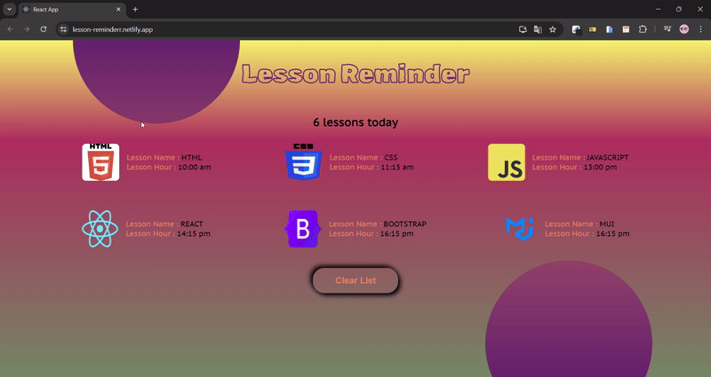

<h1>Lesson Reminder<h1>



[👉click here to lesson reminder](https://lesson-reminderr.netlify.app/)

<h2>Project Skeleton</h2>

```
Lesson Reminder  (folder)
  |          
  |---public (folder)
  |---src (folder)    
  |     |---helper (folder)
  |     |     └---data.js   
  |     |  
  |     |---components (folder)
  |     |     |---header (folder)
  |     |     |     |---Header.module.css
  |     |     |     └---Header.jsx
  |     |     |    
  |     |     └---lesson (folder)
  |     |           |---Lesson.jsx
  |     |           └---Lesson.module.css
  |     |         
  |     |
  |     |---App.js
  |     |---Index.js
  |     └---Index.css
  |         
  |----package.json
  |----yarn.lock
  └----readme.md 
```